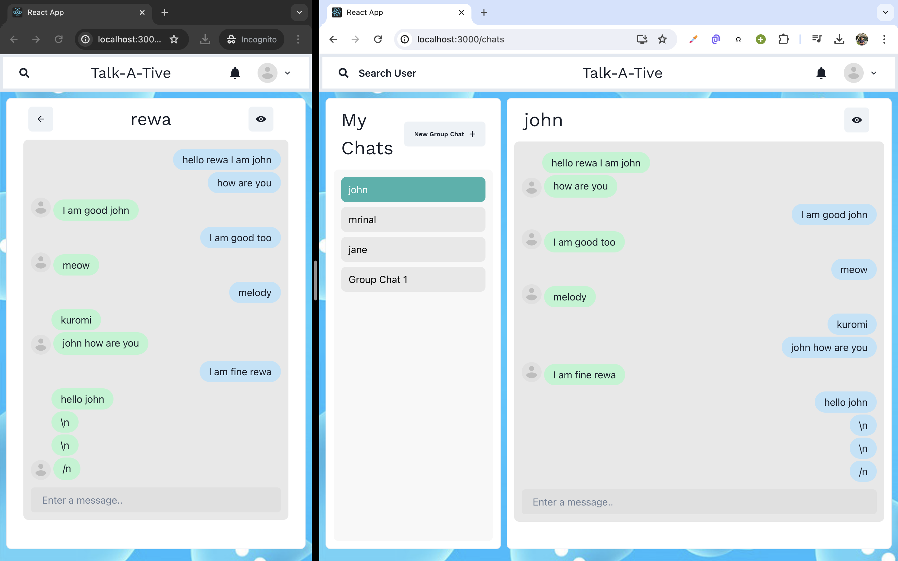

# Real time chat App


Tech Stack : React , MongoDB , Node.js , Express.js, Socket.IO, CHAKRA UI

# Features :
- Responsive
- Group Chat 
   - Rename Group Chat
   - Add new members
   - Remove Members
- Real Time Communication 
- Notification Alert for new messages
- Searching New Users
- Messages are stored on cloud 
- Set DP (Display Picture) enabled via [CLOUDINARY](https://cloudinary.com/)


# SETUP
## Clone the repository
```bash
git clone https://github.com/mrinal-rangers/chat-app-2.git
```
## For Backend :
```bash
npm i
cd backend
npm start
```

## For Frontend :
```bash
cd frontend
npm i
npm start
```


## CLASS DIAGRAM

+-----------------------------------+
|               User                |
+-----------------------------------+
| - _id: String                     |
| - name: String                    |
| - email: String                   |
| - password(hashed): String        |
| - picture: Image                  |
+-----------------------------------+
| + User(_id, name, email, password,|
|   picture)                        |
+-----------------------------------+

+-----------------------------------+
|               Chat                |
+-----------------------------------+
| - _id: String                     |
| - chatName: String                |
| - isGroupChat: Boolean            |
| - admin: User._id                 |
| - users: Array<User>              |
| - latestMessage: Message          |
+-----------------------------------+
| + Chat(_id, chatName, isGroupChat,|
|   admin, users, latestMessage)    |
+-----------------------------------+

+-----------------------------------+
|             Message               |
+-----------------------------------+
| - _id: String                     |
| - sender: User                    |
| - Chat: Chat._id                  |
| - content: String                 |
+-----------------------------------+
| + Message(_id, sender, Chat,      |
|   content)                        |
+-----------------------------------+

